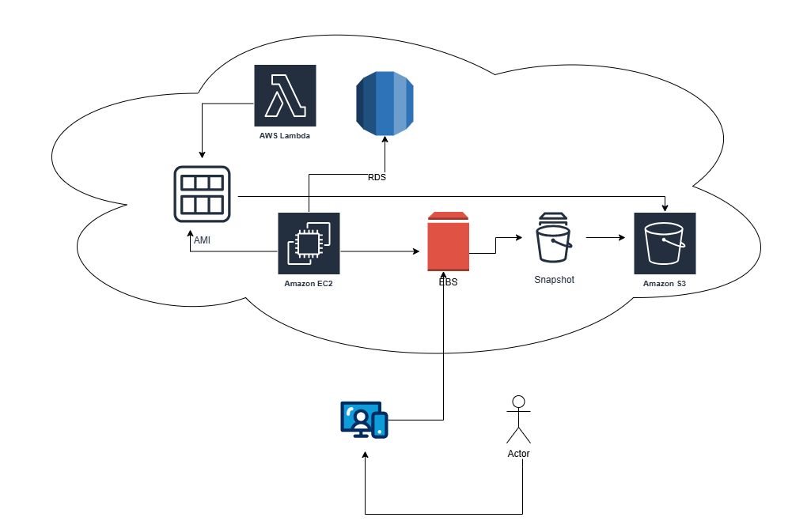

# 🚀 Projeto de Exemplo: Arquitetura Web na AWS

Este repositório documenta uma arquitetura de aplicação web padrão implementada na Amazon Web Services (AWS). O diagrama abaixo ilustra os principais componentes e o fluxo de dados entre eles, demonstrando uma solução escalável e resiliente.

## Diagrama da Arquitetura

## 🏗️ Descrição dos Componentes

A arquitetura é composta pelos seguintes serviços da AWS, cada um com uma função específica:

* **Usuário Final:** Representado pelo ícone de computador/móvel, é o cliente que acessa a aplicação.
* **Amazon EC2 (Elastic Compute Cloud):** O servidor de aplicação principal. Ele hospeda a lógica de negócios (backend) e potencialmente o frontend da aplicação.
* **AMI (Amazon Machine Image):** A imagem de máquina usada para lançar a instância EC2. Contém o sistema operacional, configurações e dependências da aplicação, garantindo consistência nas implantações.
* **EBS (Elastic Block Store):** O volume de armazenamento de bloco persistente anexado à instância EC2. Funciona como o "disco rígido" do servidor, armazenando o sistema operacional e os dados da aplicação.
* **AWS Lambda:** Um serviço de computação sem servidor (serverless). Neste diagrama, é invocado pela instância EC2 para executar tarefas específicas ou processamento assíncrono, como processar um pedido ou atualizar um registro.
* **RDS (Relational Database Service):** O banco de dados relacional gerenciado. Tanto a instância EC2 quanto a função Lambda se conectam a ele para persistir e consultar dados estruturados.
* **Snapshot EBS:** Uma cópia de segurança (backup) pontual do volume EBS. Essencial para recuperação de desastres e versionamento de dados.
* **Amazon S3 (Simple Storage Service):** O serviço de armazenamento de objetos onde os Snapshots do EBS são armazenados de forma durável e de baixo custo.

## 🔄 Fluxo de Dados e Processamento

O fluxo de operação da arquitetura pode ser descrito da seguinte maneira:

1.  **Lançamento da Instância:** A instância **Amazon EC2** é iniciada a partir de uma **AMI** pré-configurada.
2.  **Interação do Usuário:** O usuário final (cliente) envia requisições para a aplicação hospedada na instância **EC2** (provavelmente através de um Load Balancer, embora não esteja no diagrama).
3.  **Processamento Principal:** A instância **EC2** processa a requisição.
    * Ela utiliza o volume **EBS** anexado para suas operações de leitura/escrita do sistema de arquivos.
    * Ela se comunica com o banco de dados **RDS** para buscar ou salvar dados transacionais (ex: informações de usuário, pedidos, posts).
4.  **Processamento Assíncrono:** Para tarefas que não precisam ser síncronas (ex: enviar um e-mail de confirmação, gerar um relatório), a instância **EC2** invoca uma função **AWS Lambda**.
5.  **Acesso ao Banco de Dados (Lambda):** A função **Lambda** também tem permissão para se conectar ao banco de dados **RDS** para realizar suas próprias operações de leitura ou escrita.
6.  **Rotina de Backup:**
    * Periodicamente (através de um serviço como o AWS Backup ou um script agendado), um **Snapshot** é criado a partir do volume **EBS**.
    * Esse **Snapshot** é automaticamente armazenado no **Amazon S3**, garantindo a durabilidade e a capacidade de restaurar o volume EBS para um ponto anterior no tempo.

## 🎯 Propósito

O objetivo desta arquitetura é demonstrar uma aplicação web desacoplada e robusta:

* **Computação:** O **EC2** lida com o tráfego principal, enquanto o **Lambda** cuida de tarefas pontuais, otimizando custos e escalabilidade.
* **Armazenamento:** Os dados são separados: dados transacionais no **RDS** e dados de sistema/aplicação no **EBS**.
* **Resiliência:** O uso de **Snapshots** e **S3** fornece um mecanismo de backup e recuperação de desastres confiável para os dados do servidor de aplicação.

## 🛠️ Como Contribuir

Contribuições são bem-vindas! Se você tiver sugestões para melhorar esta arquitetura ou a documentação, sinta-se à vontade para:

1.  Fazer um "fork" deste repositório.
2.  Criar uma nova *branch* (`git checkout -b feature/minha-feature`).
3.  Fazer *commit* das suas alterações (`git commit -am 'Adiciona nova feature'`).
4.  Fazer *push* para a *branch* (`git push origin feature/minha-feature`).
5.  Abrir um *Pull Request*.

## 📄 Licença

Este projeto é distribuído sob licença.
